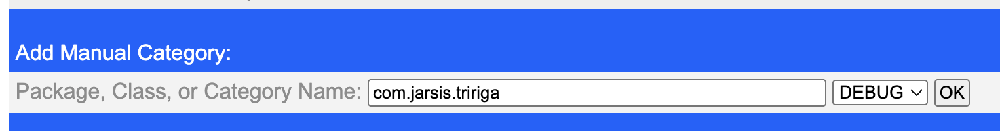
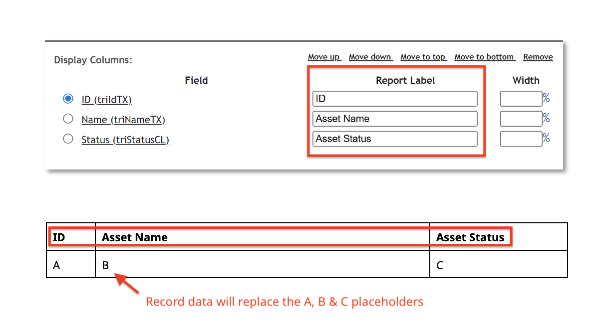
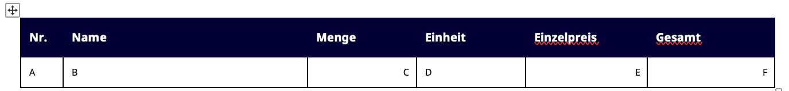
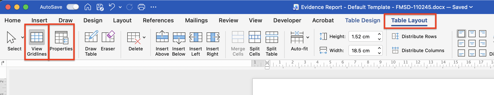
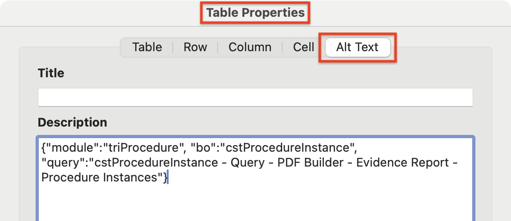
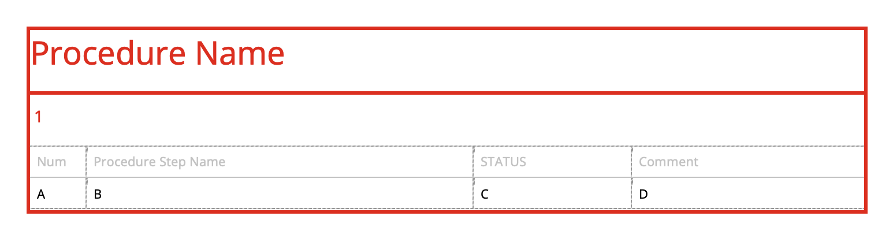
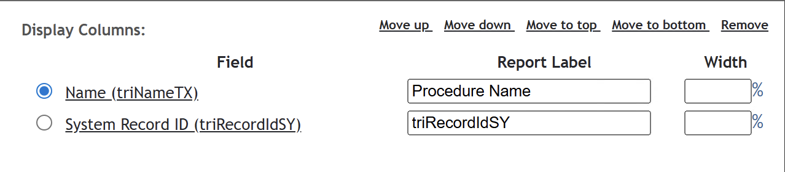

# TRIRIGA PDF Builder User Guide

## Platform Logging for Debugging & Development
Additional platform logging can be enabled in the Admin Console
1. Open the Admin Console, navigate to `Platform Logging` and scroll to the bottom of the page
1. Using the `Add Manual Category` tool, enable `DEBUG` logging for the `com.jarsis.tririga` package

This will significantly increase the information added to`server.log` when rendering PDFs.

The additional information will also be displayed in the Server.log section on the PDF Builder form.



The logging setting is unique to each TRIRIGA Server (like workflow instance recording), so it may be necesarry to configure multiple UI/Process Servers.

To disable logging, follow the steps above setting the level back to `INFO` rather than `DEBUG`. Alternatively, restart the relevant server(s).

### Sample output
``` text
2026-04-24 16:58:13,465 DEBUG [com.jarsis.tririga.tasks.CustomTask](Default Executor-thread-989) ***** Starting CstPdfBuilderTask *****
2026-04-24 16:58:13,465 DEBUG [com.jarsis.tririga.tasks.CustomTask](Default Executor-thread-989) customSmartObject spec_id: 590325348
2026-04-24 16:58:13,471 DEBUG [com.jarsis.tririga.util.FilenameGenerator](Default Executor-thread-989) Generated filename=
2026-04-24 16:58:13,474 DEBUG [com.jarsis.tririga.docx.DocxTemplateLoader](Default Executor-thread-989) Loading DOCX template, size: 35175 bytes
2026-04-24 16:58:13,474 DEBUG [com.jarsis.tririga.docx.DocxTemplateLoader](Default Executor-thread-989) Set context classloader for DOCX package loading
2026-04-24 16:58:13,481 DEBUG [com.jarsis.tririga.docx.DocxTemplateLoader](Default Executor-thread-989) Successfully loaded DOCX template
2026-04-24 16:58:13,481 DEBUG [com.jarsis.tririga.docx.DocxTemplate](Default Executor-thread-989) Building PDF from DOCX template...
2026-04-24 16:58:13,611 DEBUG [com.jarsis.tririga.docx.field.DocxFieldMapper](Default Executor-thread-989) Mapping fields from DOCX template to source smart object...
2026-04-24 16:58:13,614 DEBUG [com.jarsis.tririga.customsmartobject.field.CustomLocatorField](Default Executor-thread-989) Populating linked CustomSmartObject for spec_id 127837992 in Locator field triCustomerOrgTX[triNameTX]
2026-04-24 16:58:13,619 DEBUG [com.jarsis.tririga.customsmartobject.CustomSmartObject](Default Executor-thread-989) triModifiedSY retrieved from cache.
2026-04-24 16:58:13,620 DEBUG [com.jarsis.tririga.docx.field.DocxFieldMapper](Default Executor-thread-989) Field value map:
2026-04-24 16:58:13,620 DEBUG [com.jarsis.tririga.docx.field.DocxFieldMapper](Default Executor-thread-989) Field: triNameTX = Schedule Hassan Precondition - WEEKLY
2026-04-24 16:58:13,620 DEBUG [com.jarsis.tririga.docx.field.DocxFieldMapper](Default Executor-thread-989) Field: "mod":"triAsset", "bo":"", "ass":"Requested Assets", "field":"triIdTX" = 
2026-04-24 16:58:13,620 DEBUG [com.jarsis.tririga.docx.field.DocxFieldMapper](Default Executor-thread-989) Field: triCustomerOrgTX[triNameTX] = DFMG Deutsche Funkturm GmbH
...
2026-04-24 16:58:13,620 DEBUG [com.jarsis.tririga.docx.field.DocxFieldMapper](Default Executor-thread-989) Field: triDescriptionTX = Schedule Hassan Precondition 1
2026-04-24 16:58:13,620 DEBUG [com.jarsis.tririga.docx.field.DocxFieldMapper](Default Executor-thread-989) Field: cstAddressTX = 
2026-04-24 16:58:13,631 DEBUG [com.jarsis.tririga.customsmartobject.CustomSmartObject](Default Executor-thread-989) RecordInformation::triIdTX retrieved from cache.
2026-04-24 16:58:13,633 DEBUG [com.jarsis.tririga.docx.util.DocxTableUtil](Default Executor-thread-989) Table DESCRIPTION: {"module":"triProcedure", "bo":"cstProcedureInstance", "query":"cstProcedureInstance - Query - PDF Builder - Evidence Report - Procedure Instances"}
2026-04-24 16:58:13,640 DEBUG [com.jarsis.tririga.docx.util.DocxTableUtil](Default Executor-thread-989) Table DESCRIPTION: {"module":"triProcedure", "bo": "cstProcedureStepInstance", "query": "cstProcedureStepInstance - Query - PDF Builder - Evidence Report - Procedure Step Instances"}
2026-04-24 16:58:14,105 DEBUG [com.jarsis.tririga.docx.DocxPdfConverter](Default Executor-thread-989) Successfully converted DOCX to PDF: 27783 bytes
2026-04-24 16:58:14,105 DEBUG [com.jarsis.tririga.customsmartobject.field.binary.CustomBinaryField](Default Executor-thread-989) Setting binary field value with file name:  and MIME type: application/pdf
2026-04-24 16:58:14,112 DEBUG [com.jarsis.tririga.CstPdfBuilderTask](Default Executor-thread-989) PDF Rendered in: 647 ms
2026-04-24 16:58:14,112 DEBUG [com.jarsis.tririga.CstPdfBuilderTask](Default Executor-thread-989) ***** PDF Builder completed *****
2026-04-24 16:58:14,112 DEBUG [com.jarsis.tririga.tasks.CustomTask](Default Executor-thread-989) Success=true Number of return parameters=0
2026-04-24 16:58:14,112 DEBUG [com.jarsis.tririga.tasks.CustomTask](Default Executor-thread-989) ***** CstPdfBuilderTask completed successfully. *****
```

## TRIRIGA Fields
### Normal field, directly from the source business object
* `${triNameTX}`
* `${triIdTX}`
* `${triCustomerOrgTX}`

### Normal field from a named section in the source business object (including smart sections)
* `${RecordInformation::triIdTX}`
* `${triPeopleResponsible::triIdTX}`

*Note - when there are multiple sections containing the same field name, you **must** specify the section name. This is common for fields like triIdTX, triNameTX and triPathTX.*

### Truncating fields
The following syntax can be used to truncate the value of the field (in this case triNameTX) to the specified number of characters.
This can be useful to provide more control over the document layout.

* `${triNameTX(50)}`
* `${cstExternalNumberTX(20)}`

### Locator Fields
Locator fields are linked to another record in TRIRIGA. The following mapping can be used to display data from the record linked in the locator field
* `${triCustomerOrgTX[triNameTX]}`

In this example, value of `triNameTX` is mapped from the Organization record that has been mapped into `triCustomerOrgTX`

### Associated Fields
The following JSON definition can be used to map data from associated records.
When possible, Locator Field mappings are preferred for the following reasons:
1. It gives control over which record is mapped (when there are more than one associated records, 
the association mapping will just get the first associated record that meets the definition)
2. Locator fields are able to get the data from the database without using `ibs_spec_assignments` (which is more efficient)

```json
${
	"mod":"triAsset",
	"bo":"",
	"ass":"Requested Assets",
	"field":"triIdTX"
}
```
#### Notes
1. You must prefix the JSON with `$`
1. If no value is provided for `bo`, any associated record from the specified module will be used. Module must be populated.
1. `ass` is the Association String used to fetch the desired record

### Limitations
Not all combinations of these mappings have been tested. Combining some of this syntax to create complex mappings may not work.

## Queries / Tables

### TRIRIGA Query Definition

This section descibes the typical steps for building a TRIRIGA Query to use with the PDF Builder.

It is recommended to build a new TRIRIGA query for each PDF Builder template. Copying an existing *Display* query is often a good starting point.

#### Column Labels

To configure the columns that appear in the template, make sure the `Report Labels` in the query builder match the column headings in the Word table.



#### Association Filter

Association filters should be configured to use `$$RECORDID$$` - this will run the report with an association filter for the record that is being used to populate the PDF Builder with data

Without the `$$RECORDID$$` association filter, the report will try to render the query with all the results in the system!

### Adding the Query to the .docx template

TRIRIGA Queries are added to the document output using tables in the Word document template.
1.	Insert a table into the document with the appropriate number of columns and two rows
1.	The first row will be the header row containing the column names and the second row is a placeholder for the data / TRIRIGA output
	1.	**The column names must be the same as the column Labels in the TRIRIGA Query Builder**
	1. The placeholder cells **must** contain text – this is used to style the output from TRIRIGA. 

	
 
1.	Make sure your table is selected, then, in the Ribbon, select Table Layout
	1.	It can be useful to turn on View Gridlines if your table does not have visible borders – this is especially useful if you're using nested tables
1.	Click Properties

	
 
1.	On the Alt Text tab, put the JSON query definition in the Table Description

```json
{
  	"module": "triItem",	
  	"bo": "cstQuoteLineItem",
	"query": "cstQuoteLineItem - Query - cstQuote - Has Line Item cstQuoteLineItem"
}
```



### Nested Tables

Tables can be nested in the template by including a table within the placeholder row of the word table.



In this example, the Parent Table is in red and queries Procedure Instances associated to a Work Task. Assuming the Parent Query has a column
labelled `Procedure Name`, it will be renderd in place of the `1` Placeholder.

**THE PARENT QUERY MUST ALSO INCLUDE `triRecordIdSY` AS THIS IS USED FOR THE CHILD QUERY ASSOCIATION FILTER.**



The child table is displayed in grey and displays the Procedure Steps for each Procedure.

In this example, the Child Query should have columns labelled `Num`, `Procedure Step Name`, `Status` and `Comment` - these will overwrite the placeholder text A, B, C and D respectively.

**THE CHILD QUERY MUST HAVE A `$$RECORDID$$` ASSOCIATION FILTER.**

The PDF Builder will use the value of `triRecordIdSY` from each of the rows in the Parent Table to run the Child Query. In this example,
this ensures each Procedure Instance is listed with the associated Procedure Steps.


#### Relevant java code for nested tables (last updated 24/04/2026)

```java
// Now check for nested tables in this cell and map values into those as well
// This is needed for the case where a query table is nested inside another query table
// For example, Evidence Reports contain Procedure Instances and Procedure Instance Steps
DocxQueryMapper docxQueryMapper = new DocxQueryMapper(tririgaWS, tableCell);

// Before running the query, check if triRecordIdSY has been provided in the query results
// If it has, this will be used for the $$RECORDID$$ association filter
long specId = -1L;
if (queryRow.hasNamedField("triRecordIdSY")) {
	specId = Long.valueOf(queryRow.getNamedFieldValue("triRecordIdSY"));
}
docxQueryMapper.mapTririgaQueries(specId);
```

### Notes
Tables can be used to control the document layout *without* mapping a TRIRIGA Query. When the Table Description is *not* set,
the columns and rows are fixed and the normal field mappings can be used to populate the table with data

